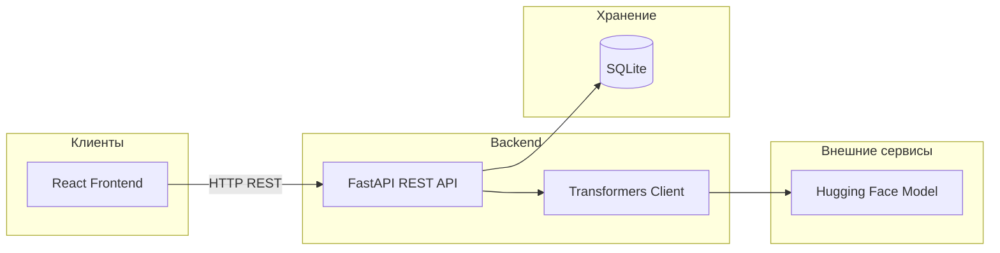
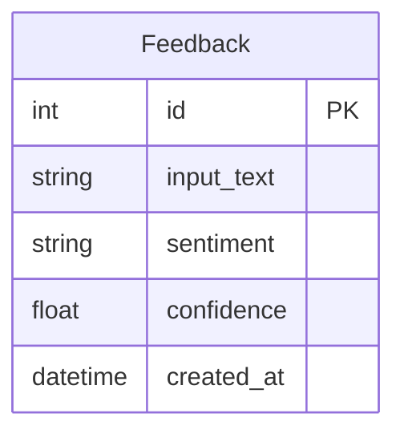

# AI Review Analyzer — Анализ тональности отзывов с помощью AI

Fullstack веб-приложение: форма ввода текста, AI-анализ тональности, история запросов и статистика в реальном времени.

---

## Описание проекта

**AI Review Analyzer** — учебный fullstack-проект, демонстрирующий построение клиент–серверного приложения с интеграцией реальной AI-модели на базе Hugging Face Transformers.

Пользователь вводит текстовый отзыв, получает результат анализа тональности (`positive` / `neutral` / `negative`) с уровнем уверенности модели. Все результаты сохраняются в SQLite и доступны в истории запросов и панели статистики.

---

## Архитектура



---

## Использованные технологии (для защиты)

### Backend

| Технология | Назначение в проекте |
|------------|----------------------|
| **Python 3** | Язык серверной части |
| **FastAPI** | REST API, маршрутизация, документация Swagger |
| **SQLModel** | ORM-слой поверх SQLAlchemy для работы с БД |
| **SQLAlchemy** | Подключение и управление SQLite |
| **Pydantic** | Валидация входных данных и схемы ответов |
| **Hugging Face Transformers** | Загрузка и запуск AI-модели тональности |
| **SQLite** | Встроенная реляционная БД: отзывы и результаты |
| **Uvicorn** | ASGI-сервер для запуска FastAPI |

### Frontend

| Технология | Назначение в проекте |
|------------|----------------------|
| **React** | UI-компоненты, состояние, хуки |
| **Vite** | Сборщик и dev-сервер |
| **JavaScript** | Логика интерфейса |
| **CSS** | Стилизация компонентов |
| **Fetch API** | Запросы к FastAPI Backend |

### Инфраструктура и инструменты

| Технология | Назначение |
|------------|------------|
| **Git** | Контроль версий |
| **npm** | Менеджер пакетов (frontend) |
| **pip / venv** | Окружение Python |

---

## Функциональные возможности

- Ввод произвольного текста и отправка на AI-анализ
- Определение тональности: `positive`, `neutral`, `negative`
- Отображение уровня уверенности модели (0.0–1.0)
- Сохранение всех результатов в базе данных
- Просмотр полной истории запросов
- Панель статистики с разбивкой по тональности
- Удаление отдельных записей из истории
- Swagger-документация API (`/docs`)

---

## Структура репозитория

```
ai-review-analyzer/
├── backend/
│   ├── main.py          # FastAPI приложение, все endpoints
│   ├── models.py        # SQLAlchemy/SQLModel модель таблицы
│   ├── database.py      # Подключение к SQLite
│   ├── ai_service.py    # Интеграция с Hugging Face Transformers
│   ├── schemas.py       # Pydantic схемы запросов/ответов
│   └── requirements.txt
├── frontend/
│   ├── src/
│   │   ├── App.jsx               # Главный компонент
│   │   ├── main.jsx              # Точка входа
│   │   ├── index.css             # Стили
│   │   └── components/
│   │       ├── AnalyzeForm.jsx   # Форма ввода текста
│   │       ├── ResultCard.jsx    # Результат анализа
│   │       ├── HistoryList.jsx   # История запросов
│   │       └── StatsPanel.jsx    # Статистика
│   ├── index.html
│   ├── package.json
│   └── vite.config.js
└── README.md
```

---

## Модель данных



- **Feedback** — запись анализа: исходный текст, результат тональности и уверенность модели

---

## REST API

| Метод | Endpoint | Описание | Авторизация |
|-------|----------|----------|-------------|
| POST | `/analyze` | Анализ текста и сохранение результата | Нет |
| GET | `/results` | История всех анализов (от новых к старым) | Нет |
| GET | `/stats` | Статистика по тональности | Нет |
| DELETE | `/results/{id}` | Удаление записи по ID | Нет |

---

## Установка и запуск

### Требования

- Python 3.11+
- Node.js 20+

### 1. Backend

```bash
# Клонировать репозиторий
git clone <url-репозитория>
cd ai-review-analyzer/backend

# Виртуальное окружение
python -m venv venv
venv\Scripts\activate        # Windows
# source venv/bin/activate   # Linux / macOS

pip install -r requirements.txt

python manage.py migrate
uvicorn main:app --reload --port 8000
```

Открыть: http://localhost:8000  
Swagger документация: http://localhost:8000/docs

> **Первый запуск** — модель `cardiffnlp/twitter-roberta-base-sentiment-latest` (~500 МБ) скачивается автоматически с Hugging Face при первом запросе.

### 2. Frontend (React + Vite)

```bash
cd frontend
npm install
npm run dev
```

Открыть: http://localhost:5173

---

## Переменные окружения

Файл `.env` в папке `frontend/` (опционально):

```env
VITE_API_URL=http://localhost:8000
```

---

## AI-модель

| Параметр | Значение |
|----------|----------|
| **Модель** | `cardiffnlp/twitter-roberta-base-sentiment-latest` |
| **Тип** | RoBERTa, обученная на ~124M твитов |
| **Классы** | `positive`, `neutral`, `negative` |
| **Библиотека** | Hugging Face `transformers` |

Модель загружается один раз при старте сервера и переиспользуется для всех запросов.

---

## Безопасность

- Валидация входных данных через Pydantic
- Каждый запрос изолирован — нет пользовательских сессий
- Секреты (при необходимости) вынесены в `.env` (не коммитятся в Git)

---

## Автор


---

## Лицензия

Учебный проект. Использование — в образовательных целях.


